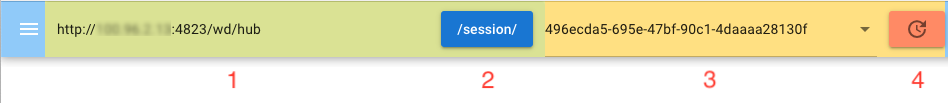

# Appium Live Inspector

An inspector to help debug the Appium tests

## :dizzy: Idea
While debugging the Appium tests, it would be easier when it is possible to inspect the app elements meanwhile.

## :crystal_ball: How to
The Appium server provides 2 endpoints:
```bash
GET /session/:session_id/source
```
In a native context (iOS, Android, etc...) it will return the application hierarchy XML.
```bash
GET /session/:session_id/screenshot
```
Takes a screenshot of the viewport in a native context (iOS, Android).

With those 2 endpoints, it is possible to build an UI-tool to inspect the app elements while debugging the Appium tests. The only parameter needs to be provided is the session-id of the running Appium test.
## :footprints: Usage
### Preparation
It is recommended to set the capability `newCommandTimeout` to a high value, e.g. 3600. So you have enough time to inspect the app.

You can set the breakpoints in your test case project and start debugging. When the breakpoint is reached and the test case stays, you can inspect the app now.
### Start

1. Input the URL of the Appium server.
2. Click on the `/session/` button to get the session id list from the Appium server.
3. Select the actual session id. This can be found directly in Appium server output or from driver object in the test case project.
4. Click the refresh button to load the screenshot and page source of actual screen on the mobile phone.
### Screen view

### Element tree view

### Element properties view
In the
## :stethoscope: Troubleshooting
Note that some platforms may have settings that prevent screenshots from being taken, for security reason. One such feature is the Android ```FLAG_SECURE``` layout parameter.

Only the XML format of the page souce is supported now. If the `useJSONSource` capability is used, the programm can not show the elements.

At the moment it is only tested with `UiAutomator2` and `XCUITest`
## :hammer_and_wrench: Setup
### Release binary
### Install the dependencies
```bash
npm install
```
### Start the app in development mode (hot-code reloading, error reporting, etc.)
```bash
quasar dev -m electron
```
### Build the app for production
```bash
quasar build -m electron
```
